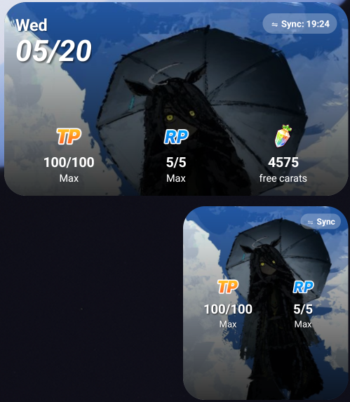
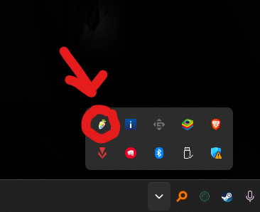
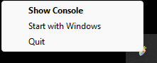
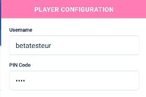
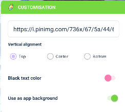

# Uma Widget & Scanner

A widget to keep track of your tp your rp and your carats on umamusume from your phone, but it's a bit more complex then you think.

  

## 🚀 Downloads (For Trainers)
If you want to install the tools, please navigate to the **[Releases](../../releases/latest)** section of this repository.

* **Android Package (.apk):** Install on your smartphone to access the home screen widgets.
* **PC Scanner (.exe/.zip):** Run alongside your game to capture and sync TP/RP data.

---

## 📖 Usage Guide

### 1. Setup the PC Scanner
Launch the **PC Scanner** while your game is running to fetch your data.

  

The scanner runs quietly in the background. You can find it in your system tray (the small arrow at the bottom right of your Windows taskbar).

  

Right-click the tray icon to enable **Start with Windows** for automatic syncing every time you turn on your PC!

  

### 2. Add the Android Widgets
Add the Large or Small widget to your Android Home Screen via your phone's standard widget menu to keep an eye on your stats.

  

### 3. Connect your Account
Open the **Uma Widget Android App** and input your Trainer credentials (Username & PIN) to link your phone with the PC scanner.

  

### 4. Customize and Sync
Personalize your widget! Add a custom background URL, choose the vertical alignment, and toggle text colors to match your style.

  

Once everything is set, hit the **Save & Sync** button to update your widgets instantly.

  

### 5. More
#### If you want to check a widget online i created the website linked to that repository do not hesitate, for any question or problem contact me on discord : x.event, else if you want to support me just follow me on [social medias](https://x-event.straw.page/)
---

## 💻 Source Code Architecture
This repository is a monorepo containing all components of the Uma Widget project:

| Directory | Description |
| :--- | :--- |
| `uma-widget-src-android/` | Android native source code (Kotlin). Contains the UI, background processing, and widget logic. |
| `uma-widget-src-scanner/` | PC data capture tool source code. made with python using notably [ddddocr-rs](https://github.com/mzdk100/ddddocr-rs) |
| `uma-widget/` | Web components, JS calculations, and Netlify deployment configs.|
#### if you need more precise information reach me out on discord x.event, and for transparency i made usage of ai to document myself faster on kotlin i can't tell if it's good or not and i hate a bit this tool since i'm a beginner and it only makes me feel bad as a developer to see it search things way better than i do, and i hate ai a bit but i also used it for the readme strucure too.
## ⚖️ License & Disclaimer
This is a fan-made tool and is not affiliated with Cygames. Use responsibly at your own risk.
